# Data Model — Enterprise Work Management System

## ERD (Mermaid)

```mermaid
erDiagram
    organizations {
        uuid id PK
        string code UK
        string name
        string logo_url
        timestamp created_at
        timestamp updated_at
    }

    departments {
        uuid id PK
        uuid org_id FK
        uuid parent_dept_id FK
        uuid manager_user_id FK
        string code UK
        string name
        timestamp created_at
        timestamp updated_at
    }

    users {
        uuid id PK
        uuid org_id FK
        uuid dept_id FK
        string email UK
        string hashed_password
        string full_name
        string employee_code
        string avatar_url
        enum role
        boolean is_active
        timestamp deleted_at
        timestamp created_at
        timestamp updated_at
    }

    projects {
        uuid id PK
        uuid org_id FK
        uuid dept_id FK
        uuid owner_user_id FK
        uuid created_by FK
        string code UK
        string name
        text description
        enum project_type
        enum status
        enum priority
        float progress_percent
        date start_date
        date end_date
        timestamp deleted_at
        timestamp created_at
        timestamp updated_at
    }

    project_members {
        uuid id PK
        uuid project_id FK
        uuid user_id FK
        enum role
        timestamp joined_at
    }

    sprints {
        uuid id PK
        uuid project_id FK
        string name
        text goal
        enum status
        date start_date
        date end_date
        timestamp created_at
        timestamp updated_at
    }

    milestones {
        uuid id PK
        uuid project_id FK
        string name
        text description
        date due_date
        enum status
        timestamp created_at
        timestamp updated_at
    }

    tasks {
        uuid id PK
        uuid project_id FK
        uuid sprint_id FK
        uuid parent_task_id FK
        uuid assignee_user_id FK
        uuid reporter_user_id FK
        string title
        text description
        enum status
        enum priority
        date start_date
        date due_date
        float estimated_hours
        float actual_hours
        jsonb tags
        timestamp deleted_at
        timestamp created_at
        timestamp updated_at
    }

    task_comments {
        uuid id PK
        uuid task_id FK
        uuid user_id FK
        text content
        timestamp created_at
    }

    task_attachments {
        uuid id PK
        uuid task_id FK
        uuid user_id FK
        string file_name
        string file_url
        integer file_size
        timestamp created_at
    }

    timesheet_entries {
        uuid id PK
        uuid user_id FK
        uuid task_id FK
        uuid project_id FK
        date work_date
        numeric hours_logged
        text description
        enum status
        timestamp submitted_at
        uuid approved_by FK
        timestamp approved_at
        text reject_reason
        timestamp created_at
        timestamp updated_at
    }

    timesheet_weekly_summaries {
        uuid id PK
        uuid user_id FK
        uuid project_id FK
        date week_start
        numeric total_hours
        integer entry_count
        timestamp created_at
        timestamp updated_at
    }

    audit_logs {
        uuid id PK
        uuid user_id FK
        string method
        string endpoint
        integer status_code
        float duration_ms
        string ip_address
        string user_agent
        string action
        string resource_type
        string resource_id
        jsonb old_value
        jsonb new_value
        timestamp created_at
    }

    organizations ||--o{ departments : "has"
    organizations ||--o{ users : "employs"
    organizations ||--o{ projects : "owns"
    departments ||--o{ departments : "parent of"
    departments ||--o{ users : "contains"
    users ||--o{ projects : "owns"
    users ||--o{ project_members : "joins"
    projects ||--o{ project_members : "has"
    projects ||--o{ sprints : "has"
    projects ||--o{ milestones : "has"
    projects ||--o{ tasks : "contains"
    sprints ||--o{ tasks : "groups"
    tasks ||--o{ tasks : "parent of"
    tasks ||--o{ task_comments : "has"
    tasks ||--o{ task_attachments : "has"
    tasks ||--o{ timesheet_entries : "tracked by"
    users ||--o{ timesheet_entries : "logs"
    users ||--o{ timesheet_weekly_summaries : "summarized for"
    projects ||--o{ timesheet_weekly_summaries : "aggregated in"
```



---

## Giải thích từng bảng

### `organizations`
Đơn vị tổ chức cấp cao nhất (tenant). Mọi entity đều thuộc về một `org_id`. Dữ liệu hoàn toàn cô lập theo tổ chức.

| Column | Mô tả |
|--------|-------|
| `code` | Mã định danh ngắn, duy nhất trong hệ thống (vd: `TSV`) |
| `logo_url` | URL logo hiển thị trên UI |

---

### `departments`
Cơ cấu phòng ban theo cây phân cấp (self-referential). Hỗ trợ nhiều cấp.

| Column | Mô tả |
|--------|-------|
| `parent_dept_id` | FK tự tham chiếu — phòng ban cha |
| `manager_user_id` | Trưởng phòng, dùng để scoping timesheet approval |
| `code` | Mã phòng ban duy nhất trong org |

**Quan hệ:** `organization` → `departments` → `users`

---

### `users`
Người dùng hệ thống. Hỗ trợ soft delete (`deleted_at`).

| Column | Mô tả |
|--------|-------|
| `role` | Enum: SUPER_ADMIN, ADMIN, MANAGER, EMPLOYEE |
| `hashed_password` | bcrypt hash — không bao giờ lưu plaintext |
| `deleted_at` | NULL = active; non-NULL = đã xóa (soft delete) |
| `employee_code` | Mã nhân viên theo hệ thống HR |

**Business rule:** Users bị soft-deleted không thể đăng nhập. Các foreign key vẫn còn nguyên để bảo toàn lịch sử.

---

### `projects`
Dự án của tổ chức. Hỗ trợ soft delete.

| Column | Mô tả |
|--------|-------|
| `code` | Mã dự án duy nhất (vd: `EWMS-2026`) |
| `project_type` | WATERFALL, AGILE, MIXED |
| `status` | PLANNING → IN_PROGRESS → ON_HOLD / COMPLETED / CANCELLED |
| `priority` | LOW, MEDIUM, HIGH, CRITICAL |
| `progress_percent` | 0–100, do PM cập nhật thủ công hoặc tính từ task |
| `owner_user_id` | Chủ dự án (có thể khác PM trong project_members) |

---

### `project_members`
Bảng join nhiều-nhiều giữa `projects` và `users`.

| Column | Mô tả |
|--------|-------|
| `role` | PM (Project Manager), MEMBER, VIEWER |

**Constraint:** `UNIQUE(project_id, user_id)` — mỗi user chỉ có một vai trò trong một dự án.

**RBAC logic:** PM có quyền cập nhật dự án; MEMBER có thể tạo task; VIEWER chỉ đọc.

---

### `sprints`
Sprint theo phương pháp Agile. Mỗi dự án chỉ có **một sprint ACTIVE** tại một thời điểm (enforce bởi service layer).

| Column | Mô tả |
|--------|-------|
| `status` | PLANNING → ACTIVE → COMPLETED |
| `goal` | Mục tiêu sprint |

---

### `milestones`
Mốc quan trọng trong dự án.

| Column | Mô tả |
|--------|-------|
| `status` | PENDING → ACHIEVED hoặc MISSED |
| `due_date` | Hạn chót milestone |

---

### `tasks`
Đơn vị công việc cơ bản. Hỗ trợ cấu trúc cây (subtasks) và nhiều trạng thái.

| Column | Mô tả |
|--------|-------|
| `parent_task_id` | FK tự tham chiếu — task cha (subtask) |
| `status` | TODO → IN_PROGRESS → IN_REVIEW → DONE / CANCELLED |
| `priority` | LOW, MEDIUM, HIGH, CRITICAL |
| `estimated_hours` | Ước tính giờ làm |
| `actual_hours` | Thực tế (tổng từ approved timesheet entries) |
| `tags` | JSONB array — nhãn tùy chỉnh |
| `reporter_user_id` | Người tạo task (set tự động) |
| `assignee_user_id` | Người được giao |

**Kanban:** Thay đổi `status` publish sự kiện Redis và vô hiệu hóa dashboard cache.

---

### `task_comments`
Bình luận trong task. Không có soft delete — lịch sử bình luận được giữ nguyên.

---

### `task_attachments`
File đính kèm của task. `file_url` trỏ đến object storage.

---

### `timesheet_entries`
Bản ghi giờ làm việc theo ngày.

| Column | Mô tả |
|--------|-------|
| `hours_logged` | NUMERIC(4,2), 0 < x ≤ 16 |
| `status` | DRAFT → SUBMITTED → APPROVED / REJECTED |
| `reject_reason` | Lý do từ chối (xóa khi nhân viên sửa lại) |
| `approved_by` | User_id của người duyệt |

**Constraints (DB level):**
- `hours_logged > 0 AND hours_logged <= 16`
- Tổng giờ trong ngày ≤ 16h (enforce tại service layer)
- `work_date` ≤ hôm nay (enforce tại service layer)

**State machine:**
```
DRAFT → SUBMITTED → APPROVED
                  → REJECTED → (edit) → DRAFT
```

---

### `timesheet_weekly_summaries`
Snapshot tổng hợp được tạo bởi scheduled job mỗi thứ 2 lúc 8 AM.

| Column | Mô tả |
|--------|-------|
| `week_start` | Ngày thứ 2 đầu tuần |
| `total_hours` | Tổng giờ APPROVED trong tuần |

**Constraint:** `UNIQUE(user_id, project_id, week_start)` — upsert an toàn.

---

### `audit_logs`
Ghi lại mọi request mutation (POST/PUT/PATCH/DELETE) vào hệ thống.

| Column | Mô tả |
|--------|-------|
| `action` | CREATE, READ, UPDATE, DELETE |
| `resource_type` | Loại resource từ URL (vd: `projects`, `tasks`) |
| `old_value` / `new_value` | JSONB — snapshot trước/sau thay đổi |

---

## Index Strategy

| Bảng | Index | Lý do |
|------|-------|-------|
| `users` | `(email)` UNIQUE | Lookup khi login |
| `users` | `(org_id, dept_id)` | Lọc users theo org/dept |
| `users` | `(deleted_at)` | WHERE deleted_at IS NULL |
| `projects` | `(code)` UNIQUE | Constraint + lookup |
| `projects` | `(org_id, status)` | List projects với filter |
| `projects` | `(owner_user_id)` | Dashboard queries |
| `projects` | `(deleted_at)` | Soft delete filter |
| `project_members` | `(project_id, user_id)` UNIQUE | Constraint + join |
| `project_members` | `(user_id)` | Fetch user's projects |
| `tasks` | `(project_id, status)` | Kanban board query |
| `tasks` | `(assignee_user_id, status)` | My tasks + workload |
| `tasks` | `(sprint_id)` | Sprint view |
| `tasks` | `(parent_task_id)` | Fetch subtasks |
| `tasks` | `(due_date)` | Overdue filter |
| `timesheet_entries` | `(user_id, work_date)` | Daily total validation |
| `timesheet_entries` | `(user_id, status)` | Pending approval list |
| `timesheet_entries` | `(task_id)` | actual_hours aggregation |
| `timesheet_weekly_summaries` | `(user_id, project_id, week_start)` UNIQUE | Upsert + lookup |
| `audit_logs` | `(user_id, created_at)` | User activity history |
| `audit_logs` | `(resource_type, resource_id)` | Resource change history |

**Nguyên tắc:**
- Chỉ index trên cột được dùng trong `WHERE`, `JOIN ON`, `ORDER BY`
- Partial index cho soft delete: `WHERE deleted_at IS NULL`
- JSONB columns (`tags`, `old_value`, `new_value`) không index — tần suất query thấp

---

## RBAC Matrix

| Resource | Action | SUPER_ADMIN | ADMIN | MANAGER | EMPLOYEE |
|----------|--------|:-----------:|:-----:|:-------:|:--------:|
| **Organization** | manage | ✓ | | | |
| **Department** | manage | ✓ | ✓ | | |
| **Department** | view | ✓ | ✓ | ✓ | ✓ |
| **User** | manage (CRUD) | ✓ | ✓ | | |
| **User** | view | ✓ | ✓ | ✓ | ✓ |
| **Project** | create | ✓ | ✓ | ✓ | |
| **Project** | view all | ✓ | ✓ | | |
| **Project** | view own/member | ✓ | ✓ | ✓ | ✓ |
| **Project** | update (as PM) | ✓ | ✓ | ✓ | |
| **Project** | delete | ✓ | ✓ | | |
| **Project Member** | add/remove | ✓ | ✓ | ✓ (own) | |
| **Sprint** | create/activate | ✓ | ✓ | ✓ (PM) | |
| **Sprint** | view | ✓ | ✓ | ✓ | ✓ |
| **Task** | create | ✓ | ✓ | ✓ | ✓ (member) |
| **Task** | view | ✓ | ✓ | ✓ | ✓ (member) |
| **Task** | update | ✓ | ✓ | ✓ | ✓ (member) |
| **Task** | change status | ✓ | ✓ | ✓ | ✓ (member) |
| **Task Comment** | create | ✓ | ✓ | ✓ | ✓ (member) |
| **Timesheet Entry** | create (own) | ✓ | ✓ | ✓ | ✓ |
| **Timesheet Entry** | update own DRAFT | ✓ | ✓ | ✓ | ✓ |
| **Timesheet Entry** | delete own DRAFT | ✓ | ✓ | ✓ | ✓ |
| **Timesheet Entry** | submit (own) | ✓ | ✓ | ✓ | ✓ |
| **Timesheet Entry** | approve | ✓ | ✓ | ✓ (dept) | |
| **Timesheet Entry** | reject | ✓ | ✓ | ✓ (dept) | |
| **Timesheet Entry** | view all | ✓ | ✓ | | |
| **Timesheet Entry** | view pending | ✓ | ✓ | ✓ (dept) | |
| **Report (Timesheet)** | view | ✓ | ✓ | ✓ | |
| **Dashboard (Executive)** | view | ✓ | ✓ | ✓ (dept) | |
| **Dashboard (Project)** | view | ✓ | ✓ | ✓ (member) | ✓ (member) |
| **Audit Log** | view | ✓ | | | |

**Ghi chú:**
- `(dept)` — Manager chỉ có quyền trong phòng ban mình quản lý
- `(member)` — Chỉ áp dụng khi là thành viên của dự án/task đó
- `(own)` — Chỉ áp dụng cho resource do chính mình tạo
- `(PM)` — Chỉ áp dụng khi có role PM trong project_members
